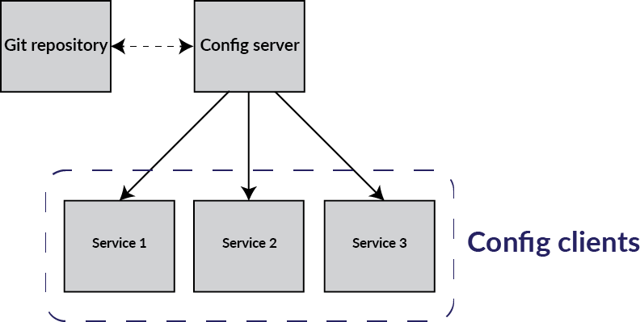

# Config-Server

**NB: THIS APPLICATION IS NOT REGISTERED IS NOT EUREKA!!!**
 
The config server is responsible for distributing centralized external configurations for each service in the cluster.

Add gitlab username and password in your command line properties if you want to get configuration from `spring-cloud-config` repo
You'ill see some kind of  `StartupService constructed, Hello: USERNAME` in the logs.

*NB: it's absoluty not recommanded to use your own gitrepo credentials when running application on production (this is only an example)*

## Diagram
 
 
 
## Usage
 
After running application, you exposes your config as REST endpoints:
 
Example : `curl http://localhost:8888/acme-service/development`
 
 The HTTP service has resources in the form:
 
     /{application}/{profile}[/{label}]
     /{application}-{profile}.yml
     /{label}/{application}-{profile}.yml
     /{application}-{profile}.properties
     /{label}/{application}-{profile}.properties
 
## Client side

See documentation about how using a git config server from acme-service easily with spring, in the [ACME README file](https://gitlab.talanlabs.com/microservices-seeds/spring-cloud-seed/blob/master/acme-service/README.md)

## References

https://docs.pivotal.io/spring-cloud-services/1-3/common/config-server/server.html

https://github.com/spring-guides/gs-centralized-configuration

- Read more about configuration in general here:

https://spring.io/blog/2015/01/13/configuring-it-all-out-or-12-factor-app-style-configuration-with-spring